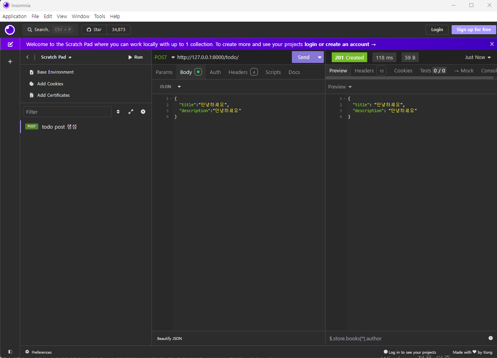

#### 1.프로젝트 생성 : django-admin startproject drf_todo

#### 2.gitignore 파일 생성

#### 3.개발 서버 구동하고 웹 사이트에 접속 후 메인 화면 확인

python manage.py runserver

#### 4.git 서버 올리기

#### 5.toto 앱 생성

python manage.py startapp todo

#### 6.settings.py 변경 및 추가(시간, Zone 변경)

각 설정 설명

DEBUG : 디버그 모드 설정
INSTALLED_APPS : pip로 설치한 앱 또는 본인이 만든 app추가
MODDELWARE_CLASSES : request와 response 사이의 주요 기능 레이어
TEMPLATES : Django template 관련 설정, 실제 뷰(html, 변수)
DATABASES : 데이터베이스 엔진의 연결 설정
STATIC_URL: 정적 파일의 URL(css, javascript, image etc..)

https://meongj-devlog.tistory.com/35

#### 7.todo 폴더에 urls.py 추가 후 drf_todo의 urls.py에 변경

#### 8. setting.py 에 todo 앱 추가

    'todo',

#### 9 models.py 에 모델 클래스 생성

#### 10 아래의 두 명령어로 DB 생성

python manage.py makemigrations
python manage.py migrate

#### 11. admin 계정(슈퍼유저) 생성

python manage.py createsuperuser
계정 : admin
암호 : 1234 로 생성

#### 12. 아래의 코드 추가후 http://127.0.0.1:8000/admin/ 으로 접속후 Todos 확인

'''
from django.contrib import admin

# Register your models here.

from .models import Todo

admin.site.register(Todo)
'''

##### 13. pip install djangorestframework 인스톨

pip install djangorestframework

settings.py 파일에 rest_framework 앱을 추가

INSTALLED_APPS = [
...
'rest_framework',
]

##### 14. Serializer 설정

class TodoSimpleSerializer(serializers.ModelSerializer):
class Meta:
model = Todo
fields = ('id', 'title', 'complete', 'important')

##### 15. View 생성

class TodosAPIView(APIView):
def get(self, request):
todos = Todo.objects.filter(complete=False)
serializer = TodoSimpleSerializer(todos, many=True)
return Response(serializer.data, status=status.HTTP_200_OK)

##### 16. urls 추가

urlpatterns = [
path('todo/', TodosAPIView.as_view()),
]

##### 17. 인소미나 설치 후 아래와 같이 테스트

##### python manage.py startapp cart

##### python manage.py makemigrations

##### python manage.py migrate

##### python manage.py runserver
